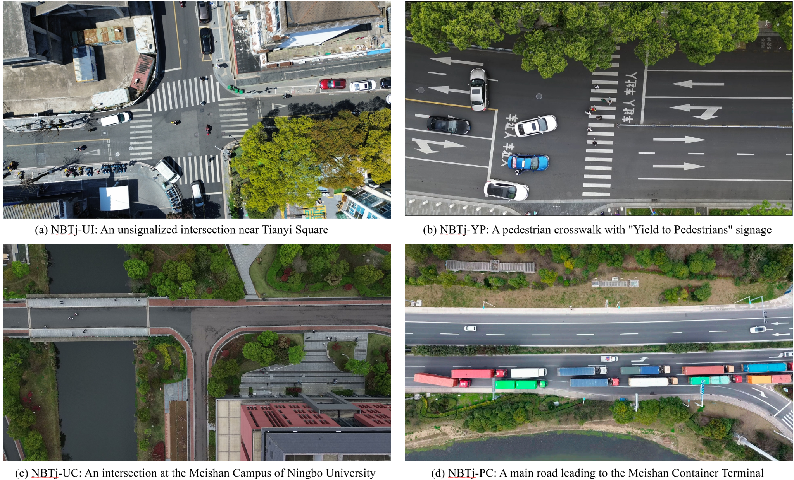

# NBTj

NBTj is a collection of four trajectory datasets: **NBTj-PC**, **NBTj-UC**, **NBTj-UI**, and **NBTj-YP**. This repository preserves the supplied data files and their directory structure and provides file-level statistics and SHA-256 checksums for reproducible use.

NBTj 包含四个基于无人机航拍的轨迹数据集，保留原始文件、目录及已有数据划分。四类拍摄场景如下。使用任何子数据集前，均须征得作者同意，并在相关研究成果中引用对应论文。

## UAV recording scenes

The four subsets cover the following drone-recorded traffic scenes.

| Dataset | UAV recording scene | 无人机拍摄场景 |
| --- | --- | --- |
| NBTj-PC | A main road leading to the Meishan Container Terminal | 通往梅山集装箱码头的主干道路 |
| NBTj-UC | An intersection at the Meishan Campus of Ningbo University | 宁波大学梅山校区内的交叉口 |
| NBTj-UI | An unsignalized intersection near Tianyi Square | 天一广场附近的无信号控制交叉口 |
| NBTj-YP | A pedestrian crosswalk with “Yield to Pedestrians” signage | 设有“车让人”标识的人行横道 |



Panel order: (a) NBTj-UI, (b) NBTj-YP, (c) NBTj-UC, and (d) NBTj-PC.

## Dataset overview

Counts below describe the supplied release. A record is one non-empty data row, excluding CSV headers. File sizes use decimal MB (1 MB = 1,000,000 bytes).

| Dataset | Files | Records | Size (MB) | Format |
| --- | ---: | ---: | ---: | --- |
| [NBTj-PC](https://github.com/WT-TrafficFlow/NBTj/releases/download/v1.0.0/NBTj-PC.zip) | 174 | 5,344,636 | 893.390 | CSV, with headers |
| [NBTj-UC](https://github.com/WT-TrafficFlow/NBTj/releases/download/v1.0.0/NBTj-UC.zip) | 1 | 835,388 | 33.276 | CSV, with headers |
| [NBTj-UI](https://github.com/WT-TrafficFlow/NBTj/releases/download/v1.0.0/NBTj-UI.zip) | 11 | 735,838 | 44.499 | CSV, with headers |
| [NBTj-YP](https://github.com/WT-TrafficFlow/NBTj/releases/download/v1.0.0/NBTj-YP.zip) | 3 | 113,904 | 4.257 | Tab-separated TXT, without headers |
| **Total** | **189** | **7,029,766** | **975.422** | |

The largest individual data file is 33,276,035 bytes. Statistics describe the files, not a validated benchmark or an official evaluation protocol.

## Download

The data are distributed as four separate ZIP archives in [Releases](https://github.com/WT-TrafficFlow/NBTj/releases/tag/v1.0.0). Use the dataset links in the overview table to download individual subsets. **Obtain the authors' permission before using the data**, as specified in [Citation and license](#citation-and-license).

Download this repository for the README, scene figure, manifest, and checksums. Extract the desired dataset ZIP archives into the repository root; each archive contains its original `NBTj-*` directory. The resulting layout is shown below. The repository source-code ZIP alone does not include the data archives.

## Directory structure after extraction

```text
NBTj/
├── README.md
├── data_manifest.json
├── SHA256SUMS
├── .gitignore
├── .gitattributes
├── uav_recording_scenes.png
├── NBTj-PC/
│   └── DJI_*.csv                  # 174 files
├── NBTj-UC/
│   └── all_trajectories_1-4(1).csv
├── NBTj-UI/
│   └── 数据/
│       └── merged_DJI_*.csv       # 11 files
└── NBTj-YP/
    ├── train/pcl_train.txt
    ├── val/pcl_val.txt
    └── test/pcl_test.txt
```

IDE settings and a temporary Word lock file from the source archive are excluded. Data files are not cleaned, resampled, renamed, or reformatted.

## Data formats

### NBTj-PC

Each file contains trajectory records with a header. The descriptions below follow the field names; physical units and coordinate conventions require confirmation from the dataset owner.

| Fields | Description |
| --- | --- |
| `Frame` | Frame identifier |
| `ID` | Object/trajectory identifier within a file |
| `cls_Name` | Original class label |
| `X_left_top`, `Y_left_top` | Bounding-box top-left coordinates |
| `X_right_bottom`, `Y_right_bottom` | Bounding-box bottom-right coordinates |
| `X_center_actual`, `Y_center_actual` | Center coordinates labeled `actual` in the source |
| `Width_actual`, `Height_actual` | Object dimensions labeled `actual` |
| `X_speed_actual`, `Y_speed_actual` | Velocity components labeled `actual` |
| `X_acceleration_actual`, `Y_acceleration_actual` | Acceleration components labeled `actual` |
| `X_center_reconstructed`, `Y_center_reconstructed` | Reconstructed center coordinates |
| `X_Jerk`, `Y_Jerk` | Jerk components |

The files contain six distinct class labels: `bigtruck`, `car`, `no_container`, `half`, `littletruck`, and `truck`. Their exact annotation definitions are not supplied; preserve these labels when loading the data.

Most files have 19 columns. `DJI_0038.csv` has an additional `Unnamed: 15` column that is empty for all 29,807 records. It is retained in the release and may be removed from an in-memory analysis table.

### NBTj-UC

| Field | Description |
| --- | --- |
| `scenario` | Scenario identifier; observed values: `1`, `2`, `3`, `4` |
| `track_id` | Trajectory identifier; use together with `scenario` |
| `frame` | Frame identifier |
| `label` | Original class label |
| `x_real_m`, `y_real_m` | Position coordinates; field names indicate meters |

Observed labels are `person`, `car`, `ebike`, and `bike`. The file contains 1,968 distinct `(scenario, track_id)` pairs. The coordinate origin, axis orientation, and frame rate are not specified in the supplied materials.

### NBTj-UI

| Fields | Description |
| --- | --- |
| `Frame` | Frame identifier |
| `ID` | Object/trajectory identifier within a file |
| `cls_Name` | Original class label |
| `X`, `Y` | Position coordinates |
| `Vx_reconstructed`, `Vy_reconstructed` | Reconstructed velocity components |
| `Ax_reconstructed`, `Ay_reconstructed` | Reconstructed acceleration components |

Observed labels are `cyclist`, `pedestrian`, and `car`. Each of the four reconstructed velocity/acceleration columns contains 8,255 empty cells across the dataset. These values are preserved; missing values must not automatically be interpreted as zero. Units, coordinate conventions, and frame rate are not documented in the supplied materials.

### NBTj-YP

The three files are tab-separated, have no header, and contain four numeric columns. The source archive does not define their semantics or units. The loading example therefore uses neutral column names; do not assume a particular benchmark format without confirming the schema.

| Supplied split | File | Records |
| --- | --- | ---: |
| Train | `train/pcl_train.txt` | 85,429 |
| Validation | `val/pcl_val.txt` | 14,238 |
| Test | `test/pcl_test.txt` | 14,237 |

These are the original directory assignments. Their construction method and independence have not been established. The other three datasets do not include explicit train/validation/test directories.

## Loading the data

The following Python example requires `pandas` and assumes the current directory is the repository root.

```python
from pathlib import Path
import pandas as pd

root = Path('.')

# PC: inspect one recording without loading the complete dataset.
pc = pd.read_csv(root / 'NBTj-PC' / 'DJI_0026.csv')
pc = pc.drop(columns=['Unnamed: 15'], errors='ignore')
pc_trajectories = pc.groupby('ID', sort=False)

# UC: track identifiers are scoped by scenario.
uc = pd.read_csv(root / 'NBTj-UC' / 'all_trajectories_1-4(1).csv')
uc_trajectories = uc.groupby(['scenario', 'track_id'], sort=False)

# UI: empty numeric fields are read as missing values.
ui = pd.read_csv(root / 'NBTj-UI' / '数据' / 'merged_DJI_0283.csv')

# YP: no header; column meanings need owner confirmation.
yp_train = pd.read_csv(
    root / 'NBTj-YP' / 'train' / 'pcl_train.txt',
    sep='\t',
    header=None,
    names=['column_1', 'column_2', 'column_3', 'column_4'],
)

print(pc.shape, uc.shape, ui.shape, yp_train.shape)
```

For all PC recordings, process one file at a time or use `pd.read_csv(path, chunksize=100_000)`. If combining recordings, add a `source_file` column and use `(source_file, ID)` to avoid merging unrelated IDs. Apply the same file-scoping rule to UI.

## Integrity and reproducibility

- `data_manifest.json` records each data file's path, byte size, row count, column names, and SHA-256 digest, together with observed class counts and basic structural checks.
- `SHA256SUMS` covers all 189 data files. On systems with `sha256sum`, run `sha256sum -c SHA256SUMS` from the repository root.
- All non-empty records have the expected number of fields for their file. This structural check does not establish physical accuracy, trajectory continuity, or freedom from duplicate records.
- CSV/TXT files are marked `-text` in `.gitattributes` to preserve their original bytes and line endings during Git checkout.

For reproducible experiments, report the repository commit, dataset subset, selected files, preprocessing, missing-value handling, temporal window construction, and split method. Confirm the sampling rate before converting frame indices to elapsed time. Do not pool class labels or coordinate values across subsets without a documented mapping.

## Citation and license

**Prior permission from the authors is required before using any part of NBTj. The datasets must not be used without the authors' consent.**

Any research, publication, or other work using the datasets must cite the relevant associated paper(s). Citation alone does not replace the requirement to obtain permission. Public availability of the files does not grant unrestricted permission to use them.

Please contact **[wangting3@nbu.edu.cn](mailto:wangting3@nbu.edu.cn)** to request permission and obtain the applicable paper references and conditions of use.

## 中文使用说明

- 四个子数据集共 189 个文件、7,029,766 条记录，原始数据约 975 MB。
- PC 包含六种原始类别标签；UC 包含四个场景；UI 包含骑行者、行人与汽车三类标签；YP 保留原有训练、验证与测试文件。
- 关联论文及其他详细采集信息、使用条件和完整类别定义，请联系数据集作者获取。**使用任何子数据集前，必须征得作者同意，并在相关研究成果中引用对应论文；未经同意不得直接使用，引用论文也不能替代使用授权。** 联系邮箱：**[wangting3@nbu.edu.cn](mailto:wangting3@nbu.edu.cn)**。
